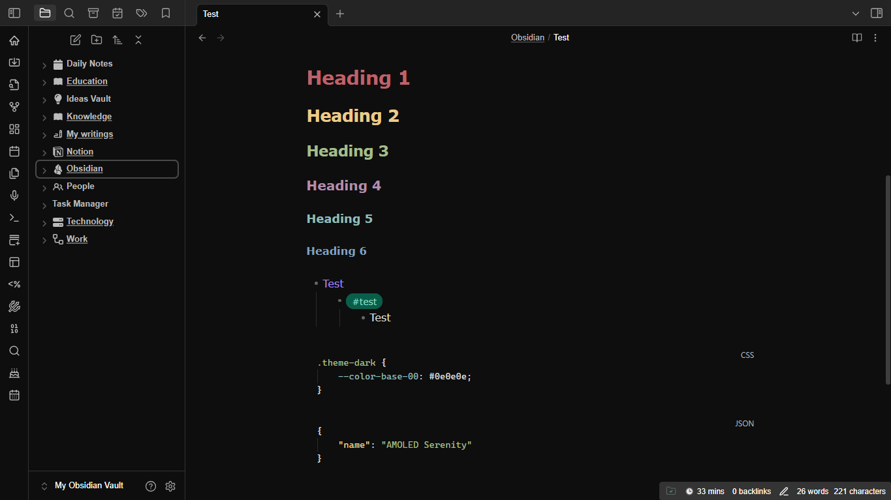

# AMOLED Serenity



## Description
**AMOLED Serenity** is a smooth, low-contrast theme designed specifically for AMOLED screens. It provides a visually calming experience with deep blacks and a focus on eye comfort, making it perfect for extended use.

## Features
- **Designed for AMOLED**: Utilizes deep blacks to save battery life and enhance visual aesthetics.
- **Dark Theme**: Provides a cohesive dark environment for a comfortable viewing experience.
- **Eye Comfort**: Low-contrast colors reduce strain during prolonged usage.
- **Calm Visual Experience**: A soothing color palette that promotes relaxation.
- **Deep Blacks**: Enhanced contrast for better visibility of text and elements.

## Inspiration
- Based on themes and ideas from:
    - [SakuraIsayeki's Vanilla AMOLED Theme](https://github.com/Sskki-exe/vanilla-amoled-theme-color)
    - [Sskki-exe's Vanilla AMOLED Theme Color](https://github.com/Sskki-exe/vanilla-amoled-theme-color/)
    - [Insanum's Obsidian Nord Theme](https://github.com/insanum/obsidian_nord/)
    - [VSCode Amoled Black Theme](https://github.com/rendinjast/amoled-black)
## Recommendations
- **Windows Night Light**: It is recommended to use this theme in conjunction with Windows Night Light for optimal eye comfort.

## Manual Installation
1. Clone the repository:
    ```bash
    git clone https://github.com/darthdemono/AMOLED-Serenity.git
    cd AMOLED-Serenity
    ```
1. Copy the `theme.css` and `manifest.json` files to the "AMOLED Serenity" Subfolder under Obsidian theme directory.
2. Load the theme through Obsidian’s theme settings.

## Usage
- Select **AMOLED Serenity** from your theme options within the application settings.
- Adjust any additional settings as needed to suit your preferences.

## Customization
Feel free to modify the `theme.css` file to tailor colors and styles to your liking. The following variables can be adjusted:
- `--color-base-*`: Base colors for backgrounds and text.
- `--accent-*`: Accent colors for various UI elements.

## License
This project is licensed under the [Beerware License](LICENSE). You are free to use and modify it, but if you meet the author in person, you are encouraged to buy them a beer.

## Author
**DarthDemono**  
Website: https://darthdemono.rf.gd/

## Contact
For any questions or feedback, please open an issue in this repository or contact me via my website.
