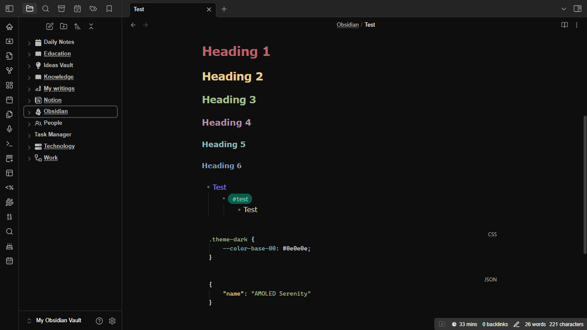

# AMOLED Serenity



## Description
**AMOLED Serenity** is a smooth, low-contrast Obsidian theme designed specifically for AMOLED screens. It provides a visually calming experience with deep blacks and a focus on eye comfort, making it perfect for extended use.

## Features
- **Designed for AMOLED**: Utilizes deep blacks to save battery life and enhance visual aesthetics.
- **Dark Theme**: Provides a cohesive dark environment for a comfortable viewing experience.
- **Eye Comfort**: Low-contrast colors reduce strain during prolonged usage.
- **Calm Visual Experience**: A soothing color palette that promotes relaxation.
- **Deep Blacks**: Enhanced contrast for better visibility of text and elements.
- **Style Settings Extension Compatibility**: Seamless integration with the Style Settings plugin, allowing for extensive customization.
- **Enhanced Customizability**: Offers a wide range of options to tailor the theme to your personal preferences.

## Inspiration
- Based on themes and ideas from:
    - [SakuraIsayeki's Vanilla AMOLED Theme](https://github.com/SakuraIsayeki/vanilla-amoled-theme)
    - [Sskki-exe's Vanilla AMOLED Theme Color](https://github.com/Sskki-exe/vanilla-amoled-theme-color/)
    - [Insanum's Obsidian Nord Theme](https://github.com/insanum/obsidian_nord/)
    - [VSCode Amoled Black Theme](https://github.com/rendinjast/amoled-black)
    - [Colineckert's Obsidian Things Theme](https://github.com/colineckert/obsidian-things)

## Recommendations
- **Windows Night Light**: It is recommended to use this Obsidian theme in conjunction with Windows Night Light for optimal eye comfort.

## Manual Installation
1. Clone the repository:
    ```bash
    git clone https://github.com/darthdemono/AMOLED-Serenity.git
    cd AMOLED-Serenity
    ```
2. Copy the `theme.css` and `manifest.json` files to the "AMOLED Serenity" subfolder under Obsidian's theme directory.
3. Load the theme through Obsidian’s theme settings.

## Usage
- Select **AMOLED Serenity** from your theme options within the Obsidian settings.
- Adjust any additional settings as needed to suit your preferences.

## Customization
Feel free to modify the `theme.css` file to tailor colors and styles to your liking. The following variables can be adjusted:
- `--color-base-*`: Base colors for backgrounds and text.
- `--accent-*`: Accent colors for various UI elements.

**Style Settings Extension Compatibility**: AMOLED Serenity is compatible with the [Style Settings plugin](https://github.com/mgmeyers/obsidian-style-settings), allowing you to customize various aspects of the theme directly from Obsidian's settings. This integration provides a dynamic user interface for adjusting theme, plugin, and snippet CSS settings.
## Changelog

**31 January 2025 (1.1.0)**

- **Enhanced Customizability**: Introduced compatibility with the Style Settings plugin, enabling users to adjust theme variables such as colors, font sizes, and styles directly from Obsidian's settings. 
- **Improved Code Syntax Highlighting**: Refined code block styling for better readability and consistency across different languages.
- **Optimized Performance**: Made adjustments to CSS to enhance theme loading times and responsiveness.

## License
This project is licensed under the [MIT License](LICENSE).

## Author
**DarthDemono**  
Website: https://darthdemono.rf.gd/

## Contact
For any questions or feedback, please open an issue in this repository or contact me via my website. 
